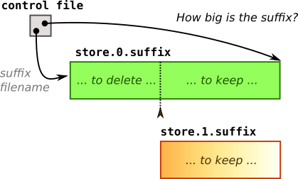
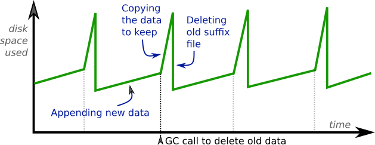
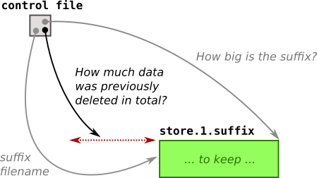
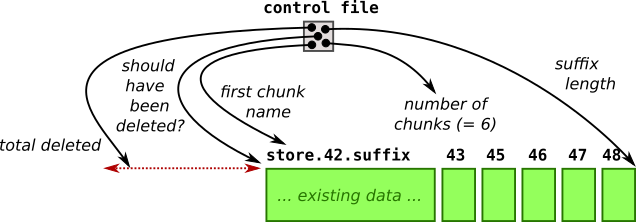

# Improve GC disk space usage

## Problem: GC disk spikes

The latest release of `irmin-pack` (3.4) adds a new "Garbage Collection" (GC) feature that is able to reclaim disk space by deleting old data. This cleaning operation can be called by the user who specifies which data should be considered "old" and deleted. In practice, we observe huge spikes of disk space usage when the GC is called:

To understand and correct this behavior, we will focus on the two files involved:

- The **control file** is the entry point into the database. It is a very small file that contains relevant information to interpret the other files used by `irmin-pack`.
- The **suffix file** is an append-only file where new objects are stored by Irmin. This is a file that grows very large and from which the GC reclaims disk space by deleting old objects.
- There are other files used by `irmin-pack`, notably the prefix which plays a role in the GC, but in this document we will ignore them for as long as they are not relevant to the issue and the proposed solution.

We can visualize the relation between the control and the suffix file as:

When an irmin-pack store is opened, the first step consists of reading the control file to discover the name of the suffix file and how big that file is supposed to be. A single store can be opened by multiple instances running at the same time:
- A single read-write instance, which is the only one allowed to make modifications to the files.
- And multiple read-only instances.

These read-only instances severely limits the operations that the read-write instance can do: It should expect at all time that the read-only instances might be looking anywhere in the suffix file, so any changes to it must be non-observable by them. As an appetizer, let's look at how the read-write instance supports the simple operation of appending new data at the end of the `suffix` file:

This write operation is not instantaneous! It will take some time proportional to the amount of new data to append. Under no circumstances should the read-only instances attempt to read this "write-in-progress" data, as it is most likely incomplete at this stage. The trick is that the read-only instances can only look at the portion of the `suffix` file that they know of, as defined by the "How big is it?" field in the control file. As such, the write-in-progress is outside of the section of the file that they are allowed to look at and the file mutation is actually safe.

After some time, the write is completed but still invisible:

In order to make this new data visible to the read-only instances, the control file must be updated **atomically** in one shot to reflect the new suffix length:

The read-only instances will periodically reload the control file and discover the new "allowed read size" of the suffix. The update of the control file is supposed to be atomic, meaning that a read-only instance won't see an incomplete update due to an in-progress write of the control file... This is only possible because the control file is so small that we expect the disk and filesystem not to break up its update into multiple partial writes.

We can now talk about the disk space spikes. When the user calls the GC to delete data past a certain age, a bunch of operations happen, culminating in the need to truncate the beginning of the suffix file:

However, due to the readers potentially looking at the "to-be-deleted" data, we can't easily get rid of it. The current strategy is to create a new suffix file, in which all the to-be-kept data is copied:

Once the copy of all the "to keep" data is completed, we can once again atomically update the control file to point to the new (truncated) suffix file. This time we will need to update the "generation" field of the control file in order to point the right suffix filename:

And finally, the previous suffix file can be deleted. This doesn't interfere with the read-only instances looking at the old suffix file, because the operating system is smart enough to delay the deletion of this file as long as it is in use. But as soon as all the read-only instances have reloaded the updated control file and switched to the new suffix, the old file is cleared!

**The huge disk space spikes are then explained by the creation of the new suffix while the old suffix still exists.** In Tezos, since the suffix is the largest file of all and since the GC is called to truncate only 1/5 of it, the disk space nearly doubles during the copying of the live data. To paraphrase capitalist investors, you need space to make space.

A small precision to make the picture complete, the control file also remembers the total amount of deleted data from the truncated suffix file:

If further GC calls remove more data, this number gets increased to always reflect the total amount of reclaimed disk space. During normal read operations on the database, Irmin needs to be able to fetch data from the truncated suffix at specific offsets: These offsets are defined as if the GC never ran, so the "total deleted" number must be subtracted before reading at the corresponding offset in the truncated suffix file.

Even though we will not mention again the read-only instances, their presence is assumed behind every change! To maintain data consistency, the control file is the only synchronization point between the read-write instance and the read-only nodes:
- Either a read-only instance is uptodate with the latest control file and all the files mentionned by the control file are ready for consumption,
- Or the read-only instance lags behind with an old version of the control file, yet its expired files are still usable with no observable defect.

## Proposed solution: chunking the suffix file

In order to avoid copying the live data in a new suffix file, we propose to cut the suffix file into multiple "chunk" files. Conceptually, the suffix file is the concatenation of all the chunk files. The new layout of the control and chunk files would then be:

Besides breaking up the suffix file, we also need to add some new fields in the control file, while keeping it small for atomic updates:

- The "name" of the first chunk : in practice, only the integer identifier and not the real filename as the rest is static
- The "number of chunks" : also just integer, which can be combined with the "name" to recover the filenames of all the chunks

We emulate the functionalities of the (now virtual) suffix file by:

- When reading at a specific offset, we can check the filesize of the chunks to discover which specific chunk should be read (all chunks except the last one are read-only so their filesize is statically cached.)
- When appending new data, we write them at the end of the last chunk (as all the previous chunks are read-only.)

### Chunked suffix GC

The truncate operation is now much easier than before and involves no data copying. In the following example, we just have to update the control file to get rid of all the chunks on the left of the GC request point (and then delete them from the filesystem):

This leads to an optimal disk usage during GC with almost no spike since we do not need to copy several cycles of data for the truncation (the remaining small spikes are related to the prefix file):

### Optimal GC

However, the chosen point of truncation becomes important to get the claimed disk space usage depicted in the above graph! In the previous example, the truncation happened on the boundary of a chunk which permitted its easy removal. In practice, the user could choose a less optimal point by requesting a GC in the middle of a chunk:

To handle this situation, another field is added to the control file: The amount of space in the first chunk that should be considered deleted (even though it still exists on the disk). This new field allows us to maintain the invariant that "garbage collected" data is unaccessible. When a GC happens on a less optimal point, it becomes less able to release disk space... but a future GC will eventually get rid of the partial chunk.

This situation should not happen in Tezos. The GC calls and the point of truncation will happen at the end of Tezos cycles. We will expose a new API function in `irmin-pack` and `lib_context`, allowing the manual creation of the chunks to align them with Tezos cycles. This function will be called at the spot of future GC points, which will guarantee an optimal layout of the chunks and no wasted disk space after a GC.

Even if the new chunks were created non-optimally, the wasted space would be at most one chunk (which can be made relatively small by calling the chunks creation function more frequently than necessary).

### Enabling optimal GC: manual chunk creation

In Irmin API, the GC is called on a user-chosen commit. All the reachable objects from that commit are copied into another file, called the `prefix`. Finally, the GC gets rid of all the old data preceding that commit by using the truncation routine described above.

In order to minimize disk waste, the chosen GC commit should be the last object of a chunk. The GC will copy this commit and its reachable data into the prefix, and then get rid of its chunk.

Since the GC frequency is user dependent, we propose to expose the manual creation of chunks with a new function. In Tezos the GC commits are the first commit of a cycle: it means that the Tezos shell will need to call for the creation of a new chunk right after persisting the first commit of a cycle.

## Migration

### Control file

To switch to the new chunked layout of the suffix file, we will have to migrate the control file from the current left side to the right version with the new fields:

We would like to make this transition as seamless as possible:

- The existing suffix file will implicitly become the first chunk.
- The migration of the control file version to add the new fields will be done on the first update operation to the store (typically a new commit, or a GC call). If no updates are made, the store will remain compatible with the previous releases of irmin in order to facilitate rollback.

After the migration with only a small update to the control file, the new layout will be active. New chunks will be created regularly and the data layout will start to look like expected:

### Original suffix as the first chunk

In the case where the existing original suffix file was large before the migration, it might take some time to get rid of the first chunk:

In Tezos situation, we expect this big chunk to be 5 or 6 cycles worth of data (while a normal chunk would only be one cycle). After 5-6 calls to the GC (= 5 or 6 Tezos cycles), this chunk will finally be removed. The expected disk space usage showing the transition period is:

It should be noted that this disk space peak is strictly equivalent to the disk space peaks produced by all the GCs of irmin 3.4.

We recommend starting from a snapshot if this the disk space usage depicted above is an issue, but present alternatives next that can be added as evolutions to the above design.

### Additional GC migration strategies

Overall, we consider the proposed GC migration strategy a safer compromise, and a required first step before other evolutions, but we acknowledge that the initial disk space consumption of the GC during the transition period might not be desirable.

We have two possible solutions that can be added as evolutions of the proposed design presented above:

**Apply Irmin 3.4 GC to existing suffix**

First, the Irmin 3.4 strategy "truncate by copying live data" could be applied to the partially garbage collected chunks (rather than keeping their inaccessible data on disk).

- This would guarantee maximal reclamation even with non-optimal chunking, at the cost of a spike in disk space during GC and increased disk I/O as data gets copied.
- For the transitional migration, the very first GC would produce a disk space peak equivalent to the largest disk space peak produced by the first design. Further GCs would keep on copying a progressively smaller first chunk, and it would also take 5 or 6 Tezos cycles to reach "normal behaviour" with no abnormal disk space overhead.

**Chunk existing suffix**

Another solution would be to split the initial big suffix into multiple chunks when opening the store in read-write mode for the first time.

- When the read-write instance starts, the read-only instances are not yet active, which allows to use a migration algorithm that doesn't have to ensure that the store supports the _Single Writer Multiple Readers_ paradigm. As such, we would be able to split the existing suffix file "in place" without doubling the disk space usage (only "one chunk" worth of disk overhead).
- It is however not clear where to split the suffix file: We don't know where the user is going to call the GC in the future, so the resulting chunks wouldn't be optimal for some time.
- Any crash / interruption / power outage during this migration would leave the store in an unrecoverable state.

--------------------------------------------------

# Appendix / WIP :)

## Risks & mitigations

### File descriptor limits

The proposed design will likely open a file descriptor for every chunk (for easier management). If the ratio of split to GC is high, this could lead to hitting file descriptor limits. In practice for Tezos, it should be low (less than 20), but if it is an issue, we can implement a file descriptor pool for the chunks to maintain an upper limit.

### Crash consistency

The guarantees are the same as before, as we do stricly less disk operations.

## Automatic vs Manual chunking

We have considered the following alternative chunking strategies, before deciding to expose a new public function to manually trigger the creation of new chunks from the user side:

- **Fixed physical size:** This could potentially split an object data between two chunks at the boundary, leading to more code complexity. The chunk physical size would have to be decided when creating the store and never change after that.
- **Fixed number of objects:** We expect a Tezos cycle to contain roughly 8'192 commit objects, but we can't detect when a cycle starts/ends on Irmin's side. Automatically creating a new chunk after seeing a given number of commits/objects is unlikely to yield an optimal alignment of the chunks with the GC commits, resulting in wasted disk space.

We believe the manual creation of chunks will better align with the needs of Tezos. In practice, since a chunk will correspond with one Tezos cycle, the chunks will have roughly the same number of objects and nearly the same physical size on disk. Furthermore, it bounds the number of file descriptors opened for the chunks to the number of kept cycles.

In the future, it would still be possible to extend Irmin's logic with automatic chunking, for non-Tezos users.

## Other GC optimization, unrelated to chunks

Before the truncation of the suffix, the GC traverses the object DAG to save reachable data into the `prefix` file. Currently, this traversal traverses the disk in a random order and uses temporary files to remember the live data later.

We believe that this step could be optimized by traversing the disk in order and by writing less data to the temporary files, hence reducing disk I/O and improving the reactivity of the Tezos node during a GC. Benchmarking will be required to validate that the improvements are not outweighted by an increased RAM consumption.
